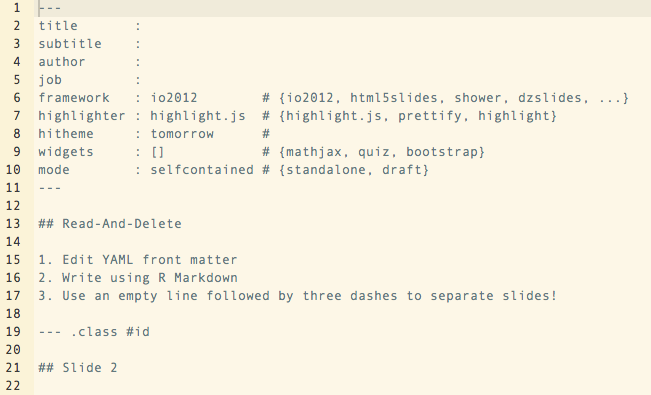
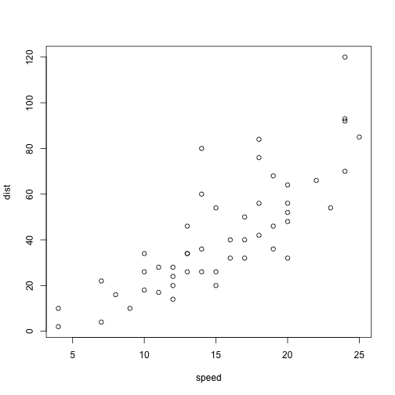
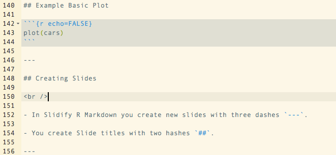

## Outline

<br />

This Weeks Goal's

Slidify HTML Slideshows

---

## This week's goals

<br />

Finish analysis

Write up results (paper + presentation)

---

## The Presentation

<br />

Next Tuesday (18 December 2012) from 17:00 to 18:15 you will present your research.

The presentations should be about 10 minutes long. 

The structure should be similar to the structure in your data. 

---

## Make it Interesting

<br />
<br />
<br />
<br />
<br />


<center>
### Make the presentation interesting by focusing on visualizations.
</center>

--- 

## Reproducible Presentations
 
<br />
<br />

You can create a reproducible presentation in R.
 
To do this use Ramnath Vaidyanathan's [Slidify](http://ramnathv.github.com/slidify/) package. 
 
Slidify lets you write in R Markdown and create HTML presentations.
 
You can host the presentations from Dropbox.
 
This allows you to include interactive visualizations in your presentation. Especially visualizations made with the GoogleVis package.

---

<iframe src = "http://dl.dropbox.com/u/12581470/Graphs/leg.violence.map.html"></iframe>

---

<iframe src="http://dl.dropbox.com/u/12581470/Graphs/external.debt.html"></iframe>

---

## Slidify Set Up (1)

First download Slidify:


```r
# Load devtools
library(devtools)

# Install Slidify and ancillary libraries
install_github("slidify", "ramnathv")
install_github("slidifyLibraries", "ramnathv")
```


--- 

## Slidify Set Up (2)

Change your working directory to where you want to save the presentation:


```r
setwd("DIRECTORY")
```


Then create a new slideshow with the `author` command:


```r
author("NewSlideShow")
```


---

## Slidify Set Up (3)

Open the file called `index.Rmd` and change the heading.



The `index.html` file that Slidify creates from `index.Rmd` will be your final slideshow.

---

## Slidify Basics

Slidify `.Rmd` files work almost exactly the same as the regular `.Rmd` files you are use to.

For example, to create a basic plot with `cars` data:

<pre><code class="erlang"><span class="pp">

```r
plot(cars)
```

</span></code></pre>

---

## Example Basic Plot

 


---

## Creating Slides

<br />

In Slidify R Markdown you create new slides with three dashes `---`. 

You create Slide titles with two hashes `##`.



---

## Compiling Slidify

<br />

To compile Slidify R Markdown documents (turn them into HTML slideshows) can use the `slidify` command on your `index.Rmd` file:


```r
slidify("index.Rmd")
```


Make sure that `index.Rmd` is in your working directory.

In [RStudio](http://www.rstudio.com/ide/) you can click the `knit HTML` button. 

The RStudio preview doesn't really work that well, but opening the `index.html` file in your web browser works perfectly.

---

## Publish

<br />

You can publish your slideshow in a number of ways. Dropbox is one easy option. 

To publish your slideshow from your Dropbox `Public` folder like this:


```r
publish("NewSlideShow", host = "dropbox")
```


Then `copy the publc link` to the `index.html` file. 

You can use the link to access the slideshow from any computer connected to the internet.


